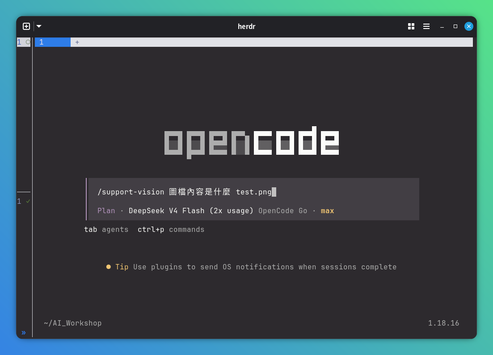
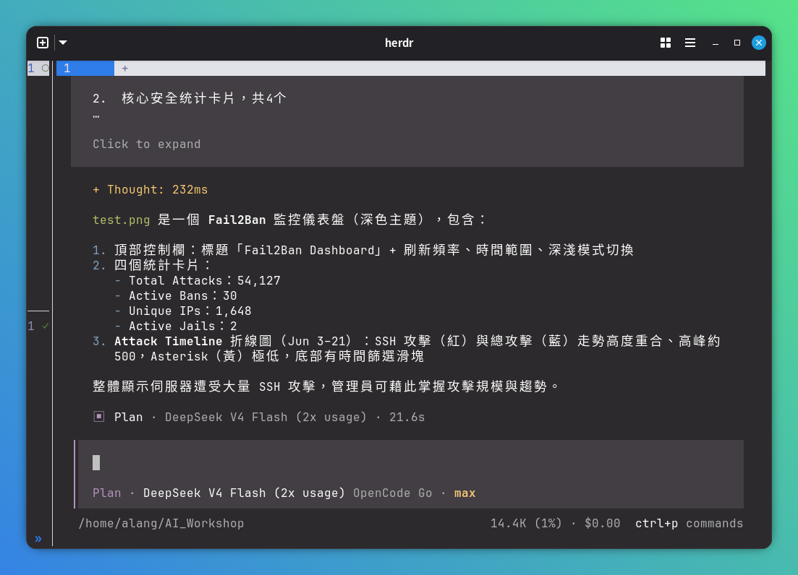

# Support Vision

> **鐵律：本技能設定的模型僅用於圖片內容辨識，絕不參與主邏輯推理。**

為 Claude Code、Codex、Pi Agent 等開發工具中的**非多模態模型**（如 deepseek-v4-pro、GLM-5.1、mimo-v2.5-pro）提供圖片辨識能力。

當主模型無法「看」圖片時，自動呼叫設定好的視覺模型來辨識圖片內容，將結果回傳給主模型繼續運作。

## 特性

- 🖼️ **多圖辨識**—支援同時傳入多張圖片比對分析
- 🔄 **自動備援**—主模型失敗後依序嘗試 fallback 模型
- 🌍 **19+ 平台**—涵蓋台灣、中國與國際主流 API（OpenAI / Gemini / 通義千問 / GLM / Ollama 等）
- 🎯 **零相依性**—只需 Node.js 18+，不需安裝
- 🛠️ **互動式設定**—`init` 指令引導選擇平台、填入金鑰、選擇模型
- 🔌 **跨工具**—適用於任何支援 Agent Skills 的工具

## 截圖





## 安裝

### `npx skills`（推薦）

```bash
npx skills add https://github.com/a-lang/support-vision -g -y
```

### Mac / Linux 一行指令

```bash
bash -c "$(curl -fsSL https://raw.githubusercontent.com/a-lang/support-vision/main/install.sh)"
```

### Git Clone（手動安裝）

```bash
git clone https://github.com/a-lang/support-vision.git ~/.agents/skills/support-vision
```

### 解除安裝

```bash
# npx skills
npx skills remove support-vision

# 手動安裝的
node install.mjs --uninstall
```

## 初始化（設定模型）

安裝後需設定一個辨識圖片的模型，只需做一次。

### git / npx skills 使用者

```bash
# Git Bash / Mac / Linux 終端機
node ~/.agents/skills/support-vision/scripts/vision.mjs init

# Windows PowerShell
node "$HOME\.agents\skills\support-vision\scripts\vision.mjs" init
```

### 在 Agent 中（Pi / Claude Code）

```
/support-vision 幫我初始化設定
/support-vision 幫我用 gemini-2.5-flash 設定主模型，API key 是 xxx
```

## 使用方法

### git / npx skills 使用者

```bash
# Git Bash / Mac / Linux
node ~/.agents/skills/support-vision/scripts/vision.mjs ./image.png

# Windows PowerShell
node "$HOME\.agents\skills\support-vision\scripts\vision.mjs" ./image.png
```

### 在 Agent 中

傳送圖片後說 `看看這張圖` / `分析這個截圖`，自動觸發。或手動：

```
/support-vision 看看這張圖
```

## 設定管理

```bash
node ~/.agents/skills/support-vision/scripts/vision.mjs init                   # 互動式初始化
node ~/.agents/skills/support-vision/scripts/vision.mjs config add             # 新增 fallback 模型
node ~/.agents/skills/support-vision/scripts/vision.mjs config edit [name]     # 編輯模型
node ~/.agents/skills/support-vision/scripts/vision.mjs config list            # 列出模型
node ~/.agents/skills/support-vision/scripts/vision.mjs config primary [name]  # 設定主模型
node ~/.agents/skills/support-vision/scripts/vision.mjs config remove <name>   # 刪除模型
node ~/.agents/skills/support-vision/scripts/vision.mjs config set-key <n> <k> # 設定金鑰
node ~/.agents/skills/support-vision/scripts/vision.mjs config set-url <n> <u> # 設定 API 位址
node ~/.agents/skills/support-vision/scripts/vision.mjs config test [name]     # 測試連通性
```

## 支援的平台

| 分類 | 平台 |
|------|------|
| 國際 | OpenAI、Google Gemini、Anthropic Claude、DeepSeek、Groq、Mistral、xAI（Grok）、OpenRouter、Fireworks AI |
| 中國 | 通義千問（Qwen VL）、智譜 GLM（GLM-4V）、Moonshot（Kimi）、階躍星辰（Step）、MiniMax、SiliconFlow（矽基流動）、小米 MiMo |
| 本機 | Ollama、LM Studio |
| 自訂 | 任何 OpenAI 相容平台（自填 baseUrl） |

## 運作原理

```
使用者發送圖片 + 問題
       ↓
 Agent 讀取 SKILL.md，呼叫 vision.mjs
       ↓
 主視覺模型 (Gemini) ──成功──→ 回傳辨識結果
       ↓ 失敗
 Fallback 1 (GPT-4o) ──成功──→ 回傳辨識結果
       ↓ 失敗
 Fallback 2 (Qwen-VL) ──成功──→ 回傳辨識結果
       ↓
 stdout 輸出文字描述 → 主模型繼續運作
```

## 目錄結構

```
support-vision/
├── SKILL.md                 ← skill 入口（Agent 自動讀取）
├── package.json
├── bin/
│   ├── cli.mjs              ← CLI 入口
│   └── postinstall.mjs      ← 安裝後自動部署 skill 檔案
├── install.mjs              ← 跨平台安裝指令碼
├── install.sh               ← Mac/Linux 一鍵安裝
├── config.example.json      ← 設定範本
├── scripts/
│   └── vision.mjs           ← 核心指令碼（零相依性）
└── references/
    └── supported-models.md
```

## License

MIT

---

[English](README.md) · [简体中文](README.zh_CN.md)
